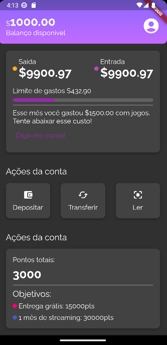

# 💰 Alubank 💰

Interface de banco usando Flutter, para aprender mais sobre temas, reutilização de componentes, testes de unidades e de widgets.

## 🛠️ Abrir e rodar o projeto

**Para executar este projeto você precisa:**

- Ter uma IDE, que pode ser o  [Android Studio](https://developer.android.com/) instalado na sua máquina
- Ter a [SDK do Flutter](https://docs.flutter.dev/get-started/install) na versão 3.0.0
